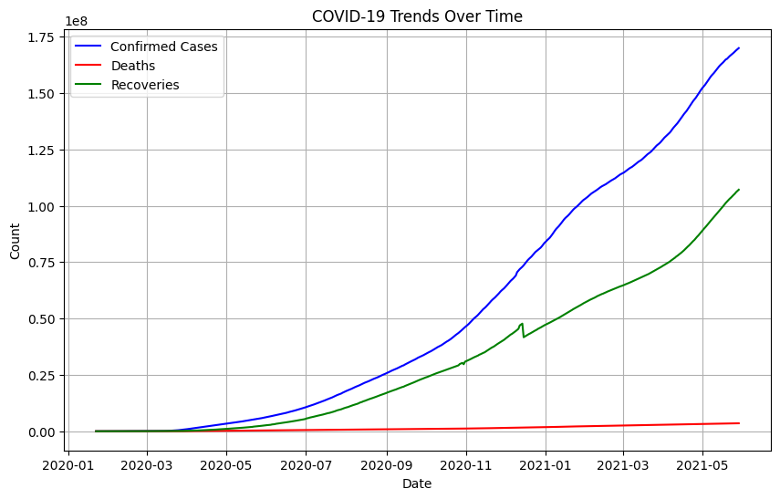

# COVID-19 Trends Analysis

## 📊 Overview
This project analyzes COVID-19 data to track trends in confirmed cases, deaths, and recoveries over time.

## 🛠️ Tools Used
- Python
- Pandas (data analysis)
- Matplotlib (visualization)

## 🔍 Key Insights
1. **Confirmed Cases**: The number of confirmed cases increased exponentially in [insert month/year].
2. **Deaths and Recoveries**: [Insert insights about deaths and recoveries].

## 📈 Visualization

## ▶️ How to Run
1. Download the dataset and Jupyter Notebook.
2. Open in Google Colab: 
